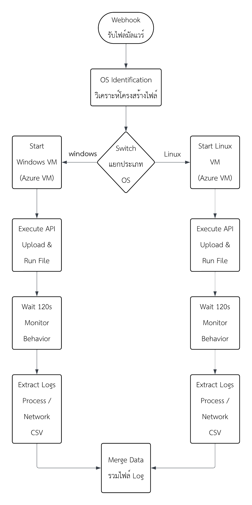

# 🛡️ AI-Powered Endpoint Detection & Response (EDR) Sandbox

## 📌 Overview
This project is an automated, AI-powered Endpoint Detection and Response (EDR) system designed to detect advanced cyber threats using dynamic behavior analysis and Large Language Models (LLMs). 

Developed as part of a Computer Engineering Senior Thesis, it integrates cross-platform malware sandboxing (Windows/Linux), anomaly detection, and AI-driven threat analysis (RAG-enhanced) to improve detection accuracy. The system achieves **85.33% overall accuracy** and an impressive **95.00% recall** in detecting sophisticated threats, including evasion techniques and C2 beaconing.

---

## 🚀 Key Features
* **🔍 Cross-Platform Sandboxing:** Automated analysis environments on Microsoft Azure for both Windows (.exe, .bat) and Linux (.elf, .sh) architectures.
* **🧠 AI-Based Threat Detection:** Utilizes Google Gemini LLM with Retrieval-Augmented Generation (RAG) to analyze complex system calls and network traffic logs.
* **📡 C2 & Beaconing Detection:** Captures and identifies abnormal outbound connections and command-and-control communications.
* **⚙️ Automated Orchestration:** Fully automated workflow managed by n8n, from file upload to VM provisioning, execution, log extraction, and teardown.
* **📊 Risk Scoring & Reporting:** Generates human-readable, context-aware threat reports mapped to the MITRE ATT&CK framework.

---

## 🦠 Tested Threats
The system has been successfully validated against advanced real-world malware and simulated threats, including:
* **Advanced Persistent Threats (APT):** APT29 simulations
* **Remote Access Trojans (RAT) & Stealers:** ValleyRAT, CobaltStrike Beacons
* **IoT/Linux Malware:** Mirai, Gafgyt

---

## 🧱 System Architecture



**Workflow:**
1. `User Upload` ➔ 2. `n8n Orchestrator` ➔ 3. `Azure VM Provisioning` ➔ 4. `Malware Execution & Monitoring (TShark/Procmon/Strace)` ➔ 5. `Log Extraction & Cleanup` ➔ 6. `Gemini AI Analysis` ➔ 7. `Threat Report Generation`

---

## 🛠️ Tech Stack
* **Frontend:** Streamlit
* **Backend & API:** Python, Flask
* **Orchestration & Automation:** n8n
* **AI / LLM:** Google Gemini API + In-Memory Vector Store (RAG)
* **Infrastructure & DevOps:** Docker, Docker Compose, Microsoft Azure (IaaS)
* **Monitoring Tools:** TShark (Network), Procmon / Strace (Process)
* **Database / Storage:** Airtable, PostgreSQL

---

## 🧩 MITRE ATT&CK Mapping Example
| Technique | Description                | Observed Behavior |
| --------- | -------------------------- | ----------------- |
| T1071     | Application Layer Protocol | C2 Beaconing to external IP |
| T1055     | Process Injection          | Memory modification in benign processes |
| T1547     | Persistence                | Registry Run keys modification |
| T1497     | Virtualization/Sandbox Evasion | Sleep delays and environment checks |

---

## ⚙️ Setup & Installation

### 1. Clone the Repository
```bash
git clone https://github.com/kritt508/ai-edr-threat-detection-system.git
cd ai-edr-threat-detection-system
```
