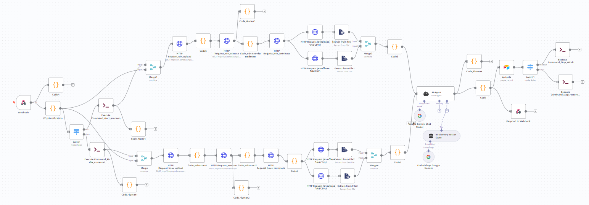
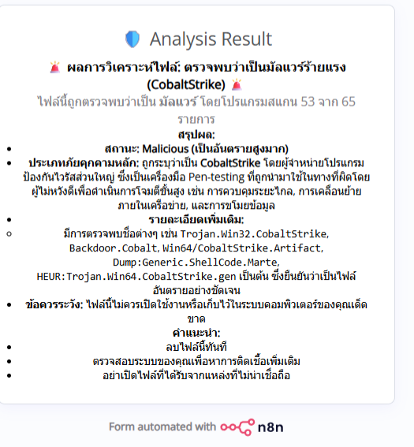

# 🛡️ AI-Powered Endpoint Detection & Response (EDR) Sandbox

[](https://www.python.org/)
[](LICENSE)
[](#-security-concepts-applied)
[](https://github.com/kritt508/ai-edr-threat-detection-system/commits/main)

## 📌 Overview
This project is an automated, AI-powered Endpoint Detection and Response (EDR) and Malware Sandboxing system. It is designed to detect advanced cyber threats, zero-day malware, and sophisticated C2 communications using **Dynamic Behavior Analysis** and **Large Language Models (LLMs)**.

Developed to bridge the gap between traditional signature-based detection and modern AI capabilities, it integrates cross-platform sandboxing (Windows/Linux), behavioral anomaly detection, and AI-driven threat intelligence (RAG-enhanced). 

**Performance Metrics:**
* **85.33% Overall Detection Accuracy** across diverse malware families.
* **95.00% Recall** in detecting sophisticated threats, including evasion techniques, process injection, and Command-and-Control (C2) beaconing.

---

## 🔒 Security Concepts Applied
This system heavily incorporates enterprise-grade cybersecurity practices:
* **Dynamic Analysis & Sandboxing:** Securely detonating potentially malicious payloads in isolated, ephemeral Microsoft Azure Virtual Machines.
* **Network & Endpoint Telemetry Collection:** Utilizing `TShark` for deep packet inspection (PCAP) and `Procmon/Strace` for capturing system calls, registry modifications, and process trees.
* **MITRE ATT&CK Mapping:** Automatically mapping observed behaviors to the MITRE ATT&CK framework (e.g., T1055 Process Injection, T1497 Sandbox Evasion).
* **Threat Intelligence & RAG:** Leveraging Retrieval-Augmented Generation to provide context-aware insights based on historical cyber threat intelligence.

---

## 🚀 Key Features
* **🔍 Cross-Platform Sandboxing:** Automated analysis environments provisioned on-the-fly for both Windows (`.exe`, `.bat`) and Linux (`.elf`, `.sh`) architectures.
* **🧠 AI-Based Threat Hunting:** Utilizes Google Gemini LLM with RAG to analyze massive volumes of raw system calls and network traffic logs, identifying malicious intent.
* **📡 C2 & Beaconing Detection:** Pinpoints abnormal outbound connections, DGA (Domain Generation Algorithms), and encrypted C2 communications.
* **⚙️ SOAR Automation Workflow:** Fully automated orchestration managed by **n8n**, covering file ingestion, VM provisioning, execution, log extraction, and secure teardown (Infrastructure as Code principles).
* **📊 Risk Scoring & Reporting:** Generates human-readable, actionable threat reports for Security Operations Center (SOC) analysts.

---

## 🦠 Tested Threats
The system has been successfully validated against advanced real-world malware and simulated threats:
* **Advanced Persistent Threats (APT):** APT29 simulations
* **Remote Access Trojans (RAT) & Stealers:** ValleyRAT, CobaltStrike Beacons
* **IoT/Linux Botnets:** Mirai, Gafgyt variants
* **Evasion:** Sleep patching and environment checking malware

---

## 🧱 System Architecture


*(System Workflow: Upload -> Orchestration -> Sandboxing -> Telemetry Extraction -> AI Analysis -> Reporting)*

**Workflow Execution:**
1. `Malware Ingestion` ➔ 2. `n8n SOAR Orchestrator` ➔ 3. `Azure VM Provisioning (Ephemeral)` ➔ 4. `Payload Detonation & Telemetry Monitoring` ➔ 5. `Log Extraction & VM Teardown` ➔ 6. `Gemini AI Behavioral Analysis` ➔ 7. `Threat Report Generation`

---

## 🖥️ System Previews

### 1. Automated SOAR Workflow (n8n)


### 2. Threat Analysis Dashboard



---

## 🛠️ Tech Stack
* **Cybersecurity Tools:** TShark, Procmon, Strace, Sysinternals
* **Frontend:** Streamlit
* **Backend & API:** Python, Flask
* **Orchestration / SOAR:** n8n
* **AI / LLM:** Google Gemini API + In-Memory Vector Store (RAG)
* **Infrastructure & DevOps:** Docker, Docker Compose, Microsoft Azure (IaaS)
* **Database:** PostgreSQL, Airtable

---

## ⚙️ Setup & Installation

### 1. Clone the Repository
```bash
git clone https://github.com/kritt508/ai-edr-threat-detection-system.git
cd ai-edr-threat-detection-system
```

### 2. Environment Configuration
Create a `.env` file based on the provided example:
```bash
cp .env.example .env
```
Ensure you configure your `GEMINI_API_KEY`, `AZURE_SUBSCRIPTION_ID`, and `NGROK_AUTHTOKEN`.

### 3. Deploy via Docker Compose
The entire system, including the n8n orchestrator, frontend, and backend, can be spun up using Docker:
```bash
cd src/frontend
docker-compose up -d --build
```

### 4. Access the Platform
* **EDR Dashboard:** `http://localhost:8501`
* **n8n SOAR Workflow Editor:** `http://localhost:5678`

---

## ⚠️ Disclaimer
**For Educational and Research Purposes Only.** 
Do not upload or execute live malware outside of the provided isolated sandbox environment. The author is not responsible for any damage caused by the misuse of this platform or accidental execution of malicious payloads on host machines.
