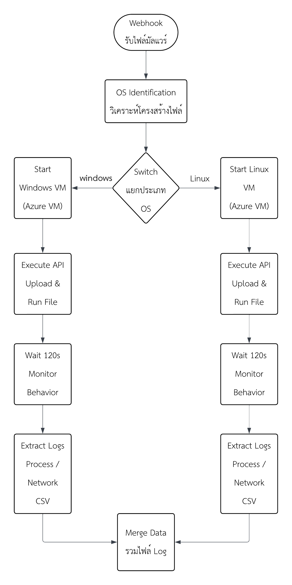
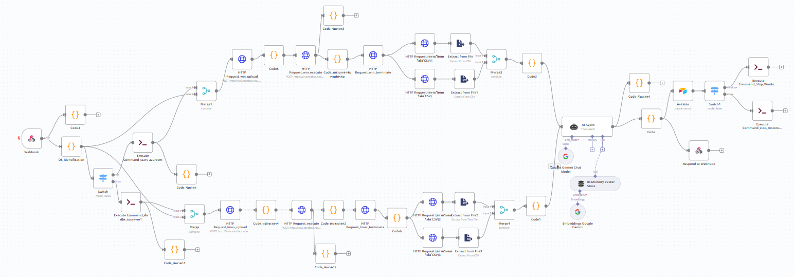
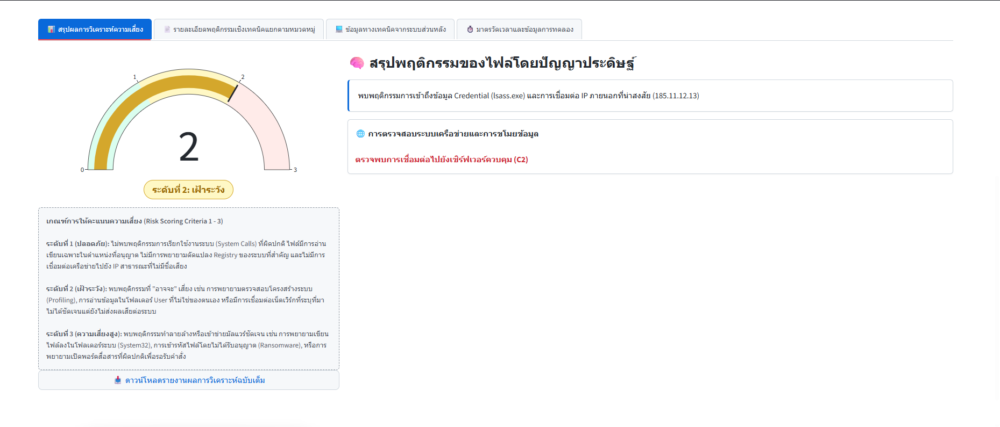

# AI-Powered Endpoint Detection and Response Sandbox

[](https://www.python.org/)
[](LICENSE)
[](#security-focus)
[](https://github.com/kritt508/ai-edr-threat-detection-system/commits/main)

An AI-assisted Endpoint Detection and Response (EDR) and malware sandboxing platform for automated behavior analysis across Windows and Linux payloads. The system orchestrates isolated Azure VM sandboxes, collects endpoint and network telemetry, applies Gemini-based analysis with retrieval-augmented context, and generates SOC-ready threat reports mapped to MITRE ATT&CK techniques.

This project was built as a blue-team security engineering portfolio project to demonstrate malware analysis automation, SOAR orchestration, telemetry engineering, LLM-assisted threat hunting, and practical detection reporting.

## Results

- 85.33% overall detection accuracy across tested malware families and simulated threats.
- 95.00% recall for sophisticated behaviors such as process injection, C2 beaconing, sandbox evasion, and abnormal outbound communication.
- Validated against APT-style simulations, RATs/stealers, Cobalt Strike-style beacons, IoT/Linux botnets, and evasion-focused samples.

## Key Capabilities

- Cross-platform sandboxing for Windows payloads such as `.exe` and `.bat`, plus Linux payloads such as `.elf` and `.sh`.
- Automated SOAR workflow using n8n for ingestion, VM provisioning, payload execution, telemetry extraction, report generation, and secure teardown.
- Endpoint telemetry collection using Procmon, Strace, Sysinternals, and process-tree analysis.
- Network telemetry collection using TShark and packet-level inspection for C2, beaconing, DGA-like patterns, and suspicious outbound traffic.
- AI-assisted behavioral analysis using Google Gemini and RAG-style contextual enrichment.
- Dynamic threat categorization into clean, infected, or specific threat-family/actor-style outcomes when supported by observed behavior.
- MITRE ATT&CK mapping for behaviors such as process injection, sandbox evasion, and command-and-control activity.
- Analyst-friendly reporting with risk scoring, observed indicators, behavioral summaries, and recommended response actions.

## System Workflow

```text
Malware Ingestion
      -> n8n SOAR Orchestrator
      -> Ephemeral Azure VM Provisioning
      -> Payload Detonation and Telemetry Monitoring
      -> Log Extraction and Sandbox Teardown
      -> Gemini Behavioral Analysis with RAG Context
      -> Threat Scoring and SOC Report Generation
```

## Architecture



The architecture separates orchestration, sandbox execution, telemetry collection, AI analysis, and reporting so each stage can be tested and improved independently. Ephemeral infrastructure keeps analysis environments disposable, while telemetry filtering reduces noise from monitoring tools and improves the quality of AI-assisted judgments.

## System Previews

### Automated SOAR Workflow



### Threat Analysis Dashboard



## Security Focus

This project emphasizes defensive security use cases:

- Dynamic malware behavior analysis in isolated environments.
- High-fidelity telemetry capture from endpoint and network sources.
- Sandbox noise exclusion to reduce false positives from analysis tooling.
- MITRE ATT&CK-aligned behavior interpretation.
- SOC-readable reporting for investigation and response.
- Safe teardown of analysis infrastructure after execution.

> This repository is intended for authorized security research, malware analysis education, and blue-team portfolio demonstration only. Do not execute unknown payloads outside a controlled and isolated lab environment.

## Tested Threat Categories

- APT-style behavior simulations, including APT29-inspired scenarios.
- Remote access trojan and stealer-style behavior, including ValleyRAT-style patterns.
- Cobalt Strike-style beaconing and command-and-control communication.
- Linux/IoT botnet behavior, including Mirai and Gafgyt-style variants.
- Evasion behavior such as sleep patching and environment checks.

## Tech Stack

| Area | Tools |
| --- | --- |
| Backend and API | Python, Flask, Flask-CORS |
| Frontend and Dashboard | Streamlit, Plotly |
| AI Analysis | Google Gemini API, RAG-style contextual enrichment |
| SOAR and Orchestration | n8n |
| Sandbox Infrastructure | Microsoft Azure virtual machines, Docker-oriented deployment |
| Endpoint Telemetry | Procmon, Strace, Sysinternals, psutil |
| Network Telemetry | TShark, PCAP analysis |
| Data Processing | pandas, NumPy |
| Storage and Tracking | PostgreSQL, Airtable |

## Repository Structure

```text
src/
  azure/        Azure VM control scripts and API server
  frontend/     Streamlit dashboard, analysis scripts, Docker setup, workflows
  n8n/          Windows and Linux telemetry filtering logic
  vm_linux/     Linux sandbox agent code
  vm_windows/   Windows sandbox agent code
docs/           Architecture and dashboard screenshots
```

## Setup

The project is optimized for Linux or WSL-based security workflows.

### 1. Clone the repository

```bash
git clone https://github.com/kritt508/ai-edr-threat-detection-system.git
cd ai-edr-threat-detection-system
```

### 2. Create a Python environment

```bash
python -m venv .venv
source .venv/bin/activate
pip install -r requirements.txt
```

### 3. Configure environment variables

Create a `.env` file for local secrets and service configuration.

```bash
GEMINI_API_KEY=your_gemini_api_key
AZURE_SUBSCRIPTION_ID=your_azure_subscription_id
AZURE_RESOURCE_GROUP=your_resource_group
DATABASE_URL=your_database_url
```

Adjust variable names to match your local orchestration and deployment setup.

### 4. Run the dashboard

```bash
cd src/frontend
streamlit run app.py
```

### 5. Run the Azure control API

```bash
python src/azure/api_server.py
```

## Portfolio Summary

Built an AI-powered EDR and malware sandboxing platform that automates cross-platform threat analysis using Azure VM sandboxes, endpoint and network telemetry, n8n SOAR workflows, and Gemini-based behavioral analysis. The system detects suspicious execution patterns, C2 beaconing, process injection, sandbox evasion, and botnet-style behavior, then generates SOC-ready threat reports with risk scoring and MITRE ATT&CK mapping.

## License

This project is licensed under the MIT License. See [LICENSE](LICENSE) for details.
